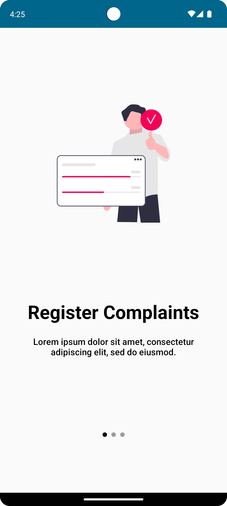
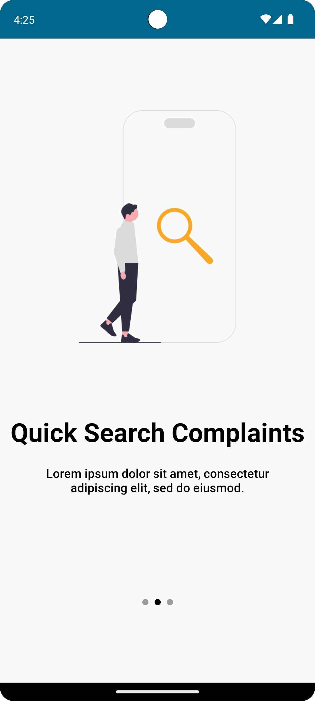
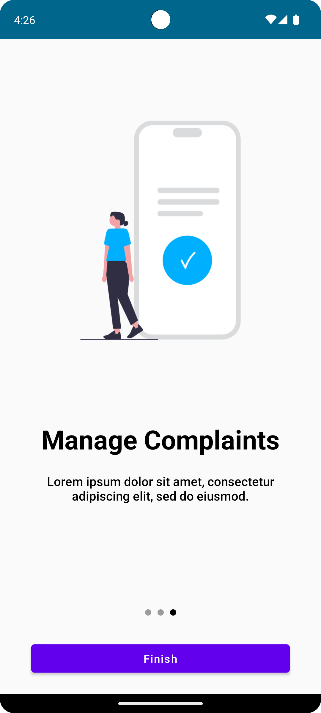
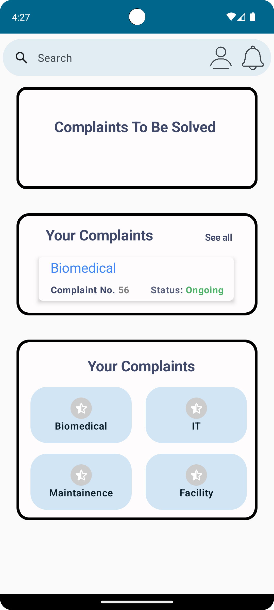
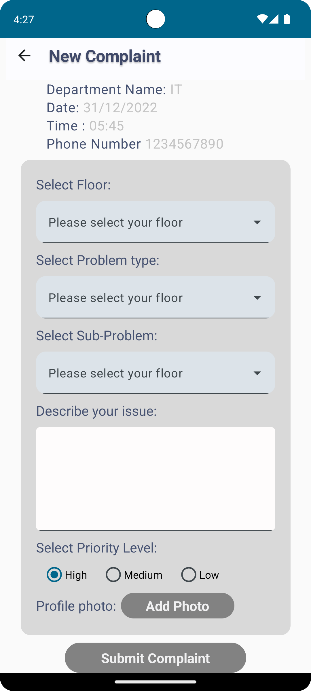
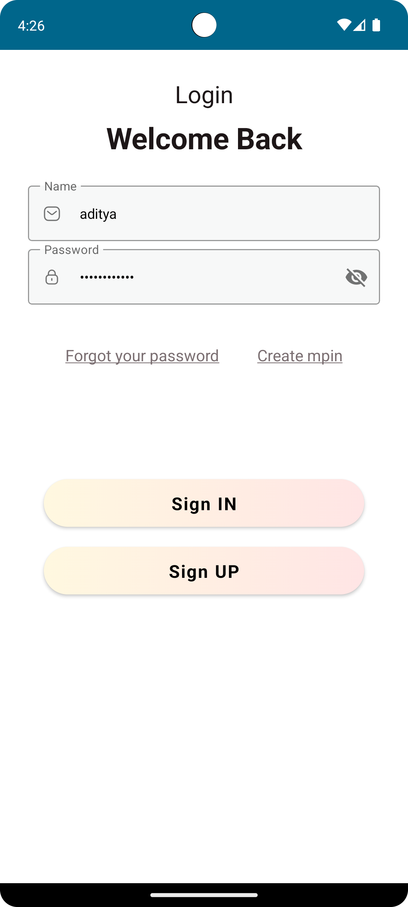

<div align="center">
 
 Complaint Tracking System
 
</div>

This is app for raising various complaints inside a hospital and tracking them.

<div align="center">

</div>

## Built with 🛠

  Ktor backend - JWT auth,SHA256 Hashing Service and tokenization.
  
  Kotlin - First class and official programming language for Android development.
  
  Coroutines - For asynchronous calls and tasks to utilize threads.
  
  Jetpack Compose UI Toolkit - Modern UI development toolkit.
  
  Android Architecture Components - Collection of libraries that help you design robust, testable, and maintainable apps.
  
  ViewModel - Stores UI-related data that isn't destroyed on UI changes.
  
  Room - Room is an Android library which is an ORM that wraps Android's native SQLite database.
  
  StateFlow and SharedFlow - StateFlow and SharedFlow are Flow APIs that enable flows to optimally emit state updates and emit values to multiple consumers.
  
  Dependency Injection -
    Hilt-Dagger - A standard way to incorporate Dagger dependency injection into an Android application.
    Hilt-ViewModel - DI for injecting ViewModel.
    
  Material Components for Android - Modular and customizable Material Design UI components for Android.

## 📱 Screenshots

<div align="center">

| | | |
|-|-|-|
|  |  |  | 
|  |  |  |
</div>

## 🚧 App is currently under construction

## 🏗️ Installation steps

1. Clone the repository

    ```bash
    git clone [https://github.com/AdityaKumdale/ComplaintTrackingSystem.git]
    ```
2. Run the app!

*Thank you,*

*Aditya*
